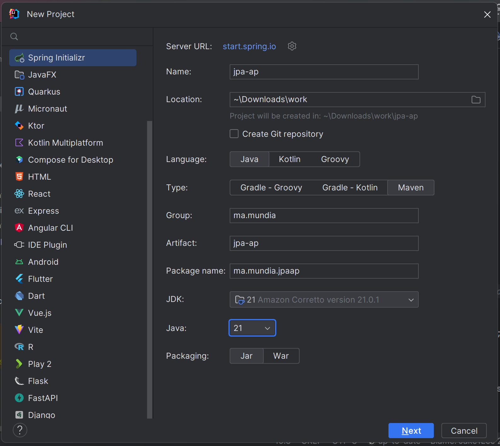
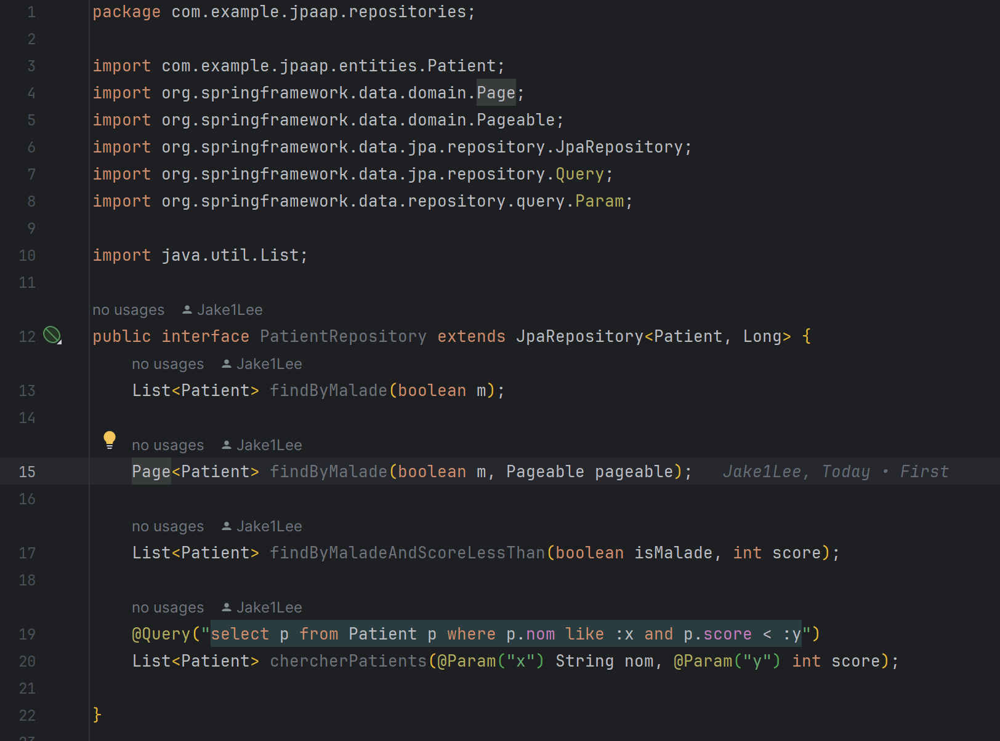

# TP2-jpa-ap

 Réalisé par Mohammed Amine Farid

# Rapport de ORM JDBC JPA Hibernate Spring Data

# Introduction

Les technologies ORM, telles que Hibernate qui implémente la spécification JPA, simplifient l'interaction entre
les applications Java et les bases de données relationnelles comme MySQL. JDBC offre une API Java standard pour
la gestion des bases de données, tandis que JPA, en tant que spécification JEE, définit une interface pour la
gestion des entités et des relations entre les objets Java et les bases de données. Spring Data, en fournissant
une couche d'abstraction pour la persistance des données, facilite encore davantage l'accès aux données,
permettant l'intégration fluide de JDBC, JPA, Hibernate, et d'autres technologies de gestion de données dans
les applications Spring.

# Enoncé

  1.  Installer IntelliJ Ultimate
  2.  Créer un projet Spring Initializer avec les dépendances JPA,H2,Spring Web et Lombock
  3.  Créer l'entité JPA Patient ayant les attributs :
     a.  id de type Long
     b.  nom de type String
     c.  date de naissance de type Date
     d.  malade de type booléen
     e.  score de type int
  4.  Configurer l'unité de persistance dans le fichier application.properties
  5.  Créer l'interface JPA Repository basée sur Spring Data
  6.  Tester quelques opérations de gestion
     a.  Ajouter des patients
     b.  Consulter tous les patients
     c.  Consulter un patient
     d.  Chercher des patients
     e.  Mettre à jour un patient
     f.  supprimer un patient
  7.  Migrer de h2 Database vers MySQL

# Projet

## Création de Projet

Après installation de IntelliJ Ultimate, on crée un projet
en utilisant Spring Initializr
On utilise language Java avec Maven

On ajoute les Dependencies suivantes:
  - Lombok
  - Spring Web
  - Spring Data JPa
  - H2 Database
  - Thymeleaf

## Création de l'entité JPA Patient avec les attributs demandés

  - id de type Long
  - nom de type String
  - dateNaissanec de type Date
  - malade de type boolean
  - score de type int

## Stocker dans H2 Database

Maintenant, on doit stocker ces données dans une base de données H2.

Dans le fichier application.properties:

On peut accéder à l'interface de la base de donnée h2, lorsqu'on saisit localhost:8082/h2-console

## Création de l'interface JPA Repository

On crée cette interface en se basant sur Spring Data de l'entité Patient.

